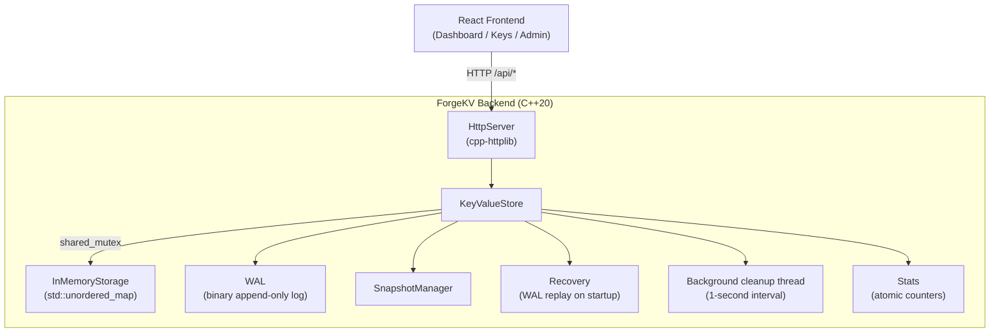

# ForgeKV

A persistent, concurrent key-value storage engine built from scratch in C++20, with a React/TypeScript management dashboard.

ForgeKV implements durability guarantees from first principles: binary write-ahead log, CRC32 corruption detection, crash recovery, log compaction, snapshots, TTL expiration, and thread-safe concurrent access — all without external storage dependencies.

---

## Table of Contents

1. [Overview](#overview)
2. [Features](#features)
3. [Architecture](#architecture)
4. [Tech Stack](#tech-stack)
5. [Project Structure](#project-structure)
6. [Building the Backend](#building-the-backend)
7. [Running ForgeKV](#running-forgekv)
8. [Deployment](#deployment)
9. [Docker](#docker)
10. [HTTP API](#http-api)
11. [Running the Frontend](#running-the-frontend)
12. [Dashboard](#dashboard)
13. [Benchmarking](#benchmarking)
14. [Testing](#testing)
15. [Persistence and Recovery](#persistence-and-recovery)
16. [Design Decisions](#design-decisions)
17. [Limitations](#limitations)
18. [Future Improvements](#future-improvements)
19. [Project Status](#project-status)

---

## Overview

ForgeKV is a key-value storage engine written in C++20, built as a learning and portfolio project. It starts as a simple in-memory hash map and grows — stage by stage — into a networked, crash-safe, concurrent storage system with a web management UI.

The primary goal is to demonstrate a deep understanding of how persistent storage systems work by building one from first principles. Every design decision — from the binary WAL record format to the snapshot-plus-replay recovery model to the shared-mutex concurrency scheme — is made deliberately and documented explicitly.

This is not a production replacement for Redis, RocksDB, or any mature database. It is a complete, working storage engine that can explain itself at every layer.

---

## Features

**Storage engine**
- In-memory store backed by `std::unordered_map`
- Write-Ahead Log (WAL) — every mutation is persisted before the in-memory state changes
- Binary WAL format with magic number, version byte, and CRC32 checksum per record
- Crash recovery — WAL replay reconstructs state on restart
- Snapshots — full-state checkpoints that accelerate recovery startup
- Log compaction — rewrites WAL to remove obsolete entries, reclaiming disk space
- TTL / key expiration — optional per-key time-to-live with background cleanup

**Concurrency**
- `std::shared_mutex` — concurrent reads, exclusive writes
- Background TTL cleanup thread (1-second interval)
- Thread-safe HTTP request handling via cpp-httplib's default thread pool

**HTTP interface**
- REST API: GET, PUT, DELETE individual keys; list keys; health check; statistics; snapshot; compact
- X-TTL-Seconds header on PUT for per-request TTL
- GET /keys with prefix filtering and cursor-style pagination

**Observability**
- GET /stats: key count, operation counters, WAL size, uptime, last snapshot time

**Benchmark suite**
- Measures throughput (ops/sec), latency percentiles (avg, P50, P95, P99), concurrency scalability, HTTP throughput, snapshot and compaction timing
- JSON output artifact consumed by the dashboard's Analytics tab

**Management dashboard**
- React/TypeScript SPA with three views: Dashboard (live stats), Keys (full CRUD), Admin (maintenance + analytics)

---

## Architecture



**Component responsibilities**

- `KeyValueStore` is the central coordinator. All operations pass through it; it owns the `shared_mutex` and coordinates WAL writes with storage mutations.
- `InMemoryStorage` holds the live key-value map and per-key expiry timestamps.
- `WAL` appends binary records to disk before each mutation. Provides `replay()` for recovery.
- `SnapshotManager` writes and loads full-state checkpoint files, storing the WAL byte offset at snapshot time.
- `Recovery` (called by `KeyValueStore` constructor) loads the most recent valid snapshot, then replays only the WAL tail written after that snapshot.
- `HttpServer` is a thin REST layer; it parses requests, calls `KeyValueStore`, and serializes JSON responses. It does not own any state.
- The TTL cleanup thread runs `do_expire_pass()` every second under an exclusive lock; it writes DEL records to the WAL for expired keys.
- Stats counters are `std::atomic<uint64_t>` updated without the storage mutex; `GET /stats` reads them with `memory_order_relaxed`.

---

## Tech Stack

| Component | Choice | Reason |
|-----------|--------|--------|
| Language | C++20 | Systems-level control; `std::shared_mutex`, `std::latch`, `std::barrier`, `std::optional` |
| Build system | CMake 3.20+ | Cross-platform, industry standard |
| HTTP library | cpp-httplib (vendored) | Single-header, MIT license, no external build dependencies |
| Testing | Custom harness (no deps) | Zero external test framework; 447 tests across 14 CTest targets |
| Frontend | React 18 + Vite 5 + TypeScript | Component model, fast dev server, type safety |
| Frontend routing | React Router v6 | Declarative client-side routing |
| Frontend CSS | CSS Modules | Scoped styles, no CSS-in-JS overhead |

External C++ dependencies are limited to one vendored header (`third_party/httplib/httplib.h`). No other libraries are required to build or run the backend.

---

## Project Structure

```
ForgeKV/
├── CMakeLists.txt          ← Build configuration; defines all targets
├── README.md
│
├── include/forgekv/        ← Public C++ headers
│   ├── kv_store.h          ← KeyValueStore (central coordinator)
│   ├── wal.h               ← WAL binary format, record layout, replay API
│   ├── snapshot.h          ← SnapshotManager
│   ├── recovery.h          ← WAL replay helpers
│   ├── storage.h           ← Storage abstract interface
│   ├── in_memory_storage.h ← std::unordered_map implementation
│   ├── http_server.h       ← HttpServer REST layer
│   └── stats.h             ← Stats struct
│
├── src/                    ← Implementation files
│   ├── kv_store.cpp
│   ├── wal.cpp
│   ├── snapshot.cpp
│   ├── recovery.cpp
│   ├── in_memory_storage.cpp
│   ├── http_server.cpp
│   └── main.cpp            ← forgekv_server entry point
│
├── tests/                  ← Test suite (14 binaries, 447 tests)
│   ├── test_kv_store.cpp           ← Stages 1–12 baseline (218 tests)
│   ├── test_http_server.cpp        ← HTTP integration (37 tests)
│   ├── test_http_keys.cpp          ← GET /keys endpoint (21 tests)
│   ├── test_http_admin.cpp         ← POST /snapshot + /compact (14 tests)
│   ├── test_wal_robustness.cpp     ← WAL corruption/truncation (22 tests)
│   ├── test_recovery_hardening.cpp ← Crash recovery (15 tests)
│   ├── test_snapshot_hardening.cpp ← Snapshot integrity (20 tests)
│   ├── test_compaction_robustness.cpp ← Compaction invariants (14 tests)
│   ├── test_ttl_hardening.cpp      ← TTL edge cases (23 tests)
│   ├── test_concurrency_hardening.cpp ← Thread safety (12 tests)
│   ├── test_http_edge_cases.cpp    ← HTTP edge cases (18 tests)
│   ├── test_boundary_cases.cpp     ← Input boundaries (17 tests)
│   ├── test_lifecycle.cpp          ← Resource lifecycle (13 tests)
│   └── test_randomized.cpp         ← State-machine fuzz (3 tests)
│
├── benchmarks/             ← Benchmark suite
│   ├── benchmark_main.cpp
│   ├── bench_harness.h
│   ├── benchmark_kv_store.cpp
│   └── benchmark_http.cpp
│
├── frontend/               ← React/TypeScript dashboard
│   ├── src/
│   │   ├── pages/          ← DashboardPage, KeysPage, AdminPage
│   │   ├── components/     ← Shared UI components
│   │   ├── services/api.ts ← HTTP client
│   │   ├── types/          ← TypeScript types
│   │   └── utils/          ← Formatting and benchmark utilities
│   ├── public/
│   │   └── benchmark-results.json ← Pre-generated benchmark artifact
│   ├── vite.config.ts
│   └── package.json
│
├── docs/                   ← Stage-by-stage design notes (01–19)
├── third_party/httplib/    ← Vendored cpp-httplib
└── examples/               ← C++ usage examples
```

---

## Building the Backend

**Prerequisites:** CMake 3.20+, a C++20-capable compiler (GCC 11+, Clang 13+, or Apple Clang 14+).

```bash
git clone https://github.com/yourusername/ForgeKV.git
cd ForgeKV

# Configure (Debug by default)
cmake -S . -B build

# Configure Release (faster; recommended for benchmarks)
cmake -S . -B build -DCMAKE_BUILD_TYPE=Release

# Build all targets
cmake --build build --parallel
```

This produces:
- `build/forgekv_server` — the HTTP server
- `build/forgekv_benchmark` — the benchmark suite
- All test binaries (`build/forgekv_tests`, `build/forgekv_http_tests`, etc.)

---

## Running ForgeKV

```bash
# Default: listens on 0.0.0.0:8080
./build/forgekv_server

# Custom port via positional argument
./build/forgekv_server 9090

# Custom port via environment variable
PORT=9090 ./build/forgekv_server
```

Port selection precedence:
1. Positional argument (`./forgekv_server 9090`) — highest priority
2. `PORT` environment variable (`PORT=9090 ./forgekv_server`)
3. Default: `8080`

On startup the server:
1. Constructs `KeyValueStore`, which opens `forgekv.wal` in the current working directory.
2. Runs crash recovery automatically (snapshot load + WAL replay if needed).
3. Starts the HTTP server and begins accepting requests.

The WAL file (`forgekv.wal`) and snapshot file (`forgekv.wal.snapshot`) are written to the directory you run the server from. Run from the project root or a dedicated data directory.

---

## Deployment

ForgeKV's HTTP server is deployment-ready for cloud platforms (e.g., Render, Railway, Fly.io) with no code changes required.

**Host binding**

The server binds to `0.0.0.0`, making it reachable on all network interfaces. This is required for containerized and cloud-hosted environments where the process must accept traffic on a platform-assigned address. For local access only, restrict access at the firewall or proxy level rather than changing the bind address.

**PORT environment variable**

Cloud platforms typically assign a port by injecting the `PORT` environment variable at runtime. ForgeKV reads `PORT` automatically:

```bash
PORT=10000 ./build/forgekv_server   # binds on port 10000
```

A positional argument overrides `PORT` when both are supplied. An invalid `PORT` value (non-numeric, or outside 0–65535) causes the process to exit immediately with a non-zero status and an error message on stderr.

**Persistent storage**

ForgeKV's WAL (`forgekv.wal`) and snapshot (`forgekv.wal.snapshot`) are written relative to the working directory at the time the server is launched. On platforms that provide an ephemeral filesystem, data will be lost on restart. To retain data across restarts, mount a persistent disk and launch the server from that directory:

```bash
cd /data   # persistent disk mount point
/app/build/forgekv_server
```

If persistence across restarts is not required (e.g., a stateless demo), no special configuration is needed.

---

## Docker

A production-ready Dockerfile is included at the project root. It uses a two-stage build: a Debian Bookworm builder that compiles `forgekv_server` with GCC and CMake, and a minimal runtime image that contains only the binary.

**Build the image:**

```bash
docker build -t forgekv:latest .
```

**Run the container (default port 8080):**

```bash
docker run -p 8080:8080 forgekv:latest
```

Verify the server is up:

```bash
curl http://localhost:8080/health
# {"status":"ok"}
```

**Run on a custom port (e.g. 9090):**

```bash
docker run -p 9090:9090 -e PORT=9090 forgekv:latest
```

ForgeKV reads the `PORT` environment variable automatically — no rebuild needed.

**Persist WAL data across restarts:**

By default the WAL is written inside the container at `/data/forgekv.wal` and is lost when the container is removed. Mount a host directory to retain data:

```bash
docker run -p 8080:8080 -v /your/data/dir:/data forgekv:latest
```

**Image details:**

| Property | Value |
|----------|-------|
| Builder base | `debian:bookworm-slim` |
| Runtime base | `debian:bookworm-slim` |
| Compiler | GCC 12.2.0 |
| Build type | Release |
| Runtime user | `forgekv` (non-root) |
| Working directory | `/data` |
| Default port | `8080` |

---

## HTTP API

All endpoints return `Content-Type: application/json`. There is no authentication.

### Key operations

#### `GET /key/:key`

Retrieve the value for a key.

| Response | Condition |
|----------|-----------|
| `200 {"key":"...","value":"..."}` | Key exists and is not expired |
| `404 {"error":"key not found"}` | Key missing or expired |
| `500 {"error":"internal server error"}` | Unexpected exception |

#### `PUT /key/:key`

Store or update a value. The raw request body is the value.

| Header | Description |
|--------|-------------|
| `X-TTL-Seconds` | Optional. Positive number (integer or decimal). Sets key expiry. Omit for permanent storage. |

| Response | Condition |
|----------|-----------|
| `200 {"status":"ok"}` | Stored successfully |
| `400 {"error":"value cannot be empty"}` | Empty request body |
| `400 {"error":"X-TTL-Seconds must be a positive number"}` | Non-numeric TTL header |
| `400 {"error":"X-TTL-Seconds must be greater than 0"}` | TTL ≤ 0 |
| `500 {"error":"internal server error"}` | Unexpected exception |

#### `DELETE /key/:key`

Remove a key.

| Response | Condition |
|----------|-----------|
| `200 {"status":"ok"}` | Key existed and was deleted |
| `404 {"error":"key not found"}` | Key missing or already expired |
| `500 {"error":"internal server error"}` | Unexpected exception |

### Listing keys

#### `GET /keys`

List live (non-expired) keys with optional filtering and pagination.

**Query parameters:**

| Parameter | Type | Default | Description |
|-----------|------|---------|-------------|
| `prefix` | string | `""` | Return only keys with this prefix |
| `limit` | integer | `50` | Page size; maximum `100` |
| `offset` | integer | `0` | Skip this many matched keys |

**Response (200):**
```json
{
  "keys": [
    { "key": "session:abc", "value": "user42", "ttl_seconds": 87.432 },
    { "key": "config:theme", "value": "dark", "ttl_seconds": -1.0 }
  ],
  "total": 2,
  "limit": 50,
  "offset": 0
}
```

`ttl_seconds` is `-1.0` for permanent keys and a non-negative float for keys with active TTL.

Keys are sorted lexicographically. Only live keys are included. The snapshot is taken under the shared lock once, so the page is consistent.

| Response | Condition |
|----------|-----------|
| `200 {...}` | Success (empty `keys` array is valid) |
| `400 {"error":"..."}` | Invalid `limit` or `offset` |
| `500 {"error":"internal server error"}` | Unexpected exception |

### Health and statistics

#### `GET /health`

Always returns `200 {"status":"ok"}`. Does not access the store.

#### `GET /stats`

Returns current operational metrics.

```json
{
  "key_count": 1042,
  "get_hits": 58341,
  "get_misses": 214,
  "set_count": 1201,
  "delete_count": 159,
  "ttl_set_count": 87,
  "expired_count": 23,
  "wal_size_bytes": 204800,
  "uptime_seconds": 312.45,
  "last_snapshot_time_us": 1724330258000000
}
```

`last_snapshot_time_us` is `0` if no snapshot has been taken this process lifetime. `uptime_seconds` is elapsed time since process start (does not persist across restarts).

### Maintenance

#### `POST /snapshot`

Triggers an immediate full-state snapshot. Returns `200 {"status":"ok"}` on success, `500` on failure. After success, `GET /stats` reflects the updated `last_snapshot_time_us`.

#### `POST /compact`

Triggers WAL compaction. Rewrites the WAL to contain only the current live state; expired keys are excluded; live TTL keys are preserved with their expiry metadata. The snapshot file is deleted during compaction (prevents stale snapshot references). Returns `200 {"status":"ok"}` on success, `500` on exception.

---

## Running the Frontend

**Prerequisites:** Node.js 18+, npm 8+.

```bash
cd frontend
npm install
npm run dev       # development server at http://localhost:5173
```

Start the ForgeKV backend first:

```bash
./build/forgekv_server   # listens on 0.0.0.0:8080 by default
```

The Vite dev server proxies all `/api/*` requests to `VITE_API_BASE_URL` (default `http://localhost:8080`), stripping the `/api` prefix before forwarding. No CORS configuration is needed on the C++ server during development.

**Configuration:**

The default backend URL is `http://localhost:8080`. To change it:

```bash
# frontend/.env.local (already in .gitignore)
VITE_API_BASE_URL=http://localhost:9090
```

**Production build:**

```bash
npm run build     # outputs to frontend/dist/
npm run preview   # serves the production build locally
```

---

## Dashboard

The frontend provides three views, accessible from the navigation bar.

**Dashboard (`/`)**

Live server health indicator and operational statistics pulled from `GET /health` and `GET /stats`. Shows key count, operation totals (GET hits/misses, SET, DELETE, TTL SET, expired), WAL size, uptime, and last snapshot time.

**Keys (`/keys`)**

Full key management UI:
- Browse all live keys with value and TTL display
- Filter by prefix
- Paginate through results
- Create new keys (with optional TTL)
- Edit existing values
- Delete keys
- View per-key TTL metadata

**Admin (`/admin`)**

Two sections:

*Server health and statistics* — same live metrics as the Dashboard, plus direct controls for triggering a snapshot or WAL compaction. Health, operation stats, and persistence stats are pulled from the live API.

*Analytics and benchmark results* — displays the contents of `frontend/public/benchmark-results.json`. This is a static artifact generated from a benchmark run; it is not a live request rate or current server throughput. The benchmark notice is displayed inline to make this clear.

**There is no authentication.** The "Dashboard" and "Admin" labels are UI organizational concepts only. ForgeKV does not implement user accounts, sessions, roles, permissions, or private namespaces. The UI is intended for local development and portfolio use.

---

## Benchmarking

The benchmark suite measures real, reproducible performance on actual hardware. No numbers are invented.

**Build and run:**

```bash
# Prefer Release build for accurate throughput numbers
cmake -S . -B build -DCMAKE_BUILD_TYPE=Release
cmake --build build --target forgekv_benchmark

# Default run (10,000 ops for HTTP, 100,000 for KV-level)
./build/forgekv_benchmark

# Common options
./build/forgekv_benchmark --operations 50000   # ops per workload
./build/forgekv_benchmark --no-http            # skip HTTP benchmark
./build/forgekv_benchmark --no-latency         # skip latency sampling
./build/forgekv_benchmark --value-size 1024    # 1 KB values
./build/forgekv_benchmark --threads 8          # concurrency cap
./build/forgekv_benchmark --help               # full usage
```

**CLI options:**

| Option | Short | Default | Description |
|--------|-------|---------|-------------|
| `--operations` | `-n` | 100,000 | Operations per workload |
| `--warmup` | `-w` | 1,000 | Warmup ops (not measured) |
| `--value-size` | `-v` | 128 | Value size in bytes |
| `--threads` | `-t` | 4 | Max threads for concurrency benchmarks |
| `--output` | `-o` | (none) | CSV output file path |
| `--no-latency` | | latency on | Skip per-op latency sampling |
| `--no-http` | | HTTP on | Skip HTTP-level workloads |
| `--large` | | off | Run 1,000,000-operation suite |
| `--json-output <file>` | | (none) | Write JSON artifact to file |
| `--format json` | | (none) | Write JSON artifact to stdout |
| `--help` | `-h` | | Show usage and exit |

**Workloads measured:**

- Sequential SET, GET (hit), GET (miss), DELETE
- Mixed workload (50% GET / 30% SET / 10% DELETE / 10% GET miss)
- TTL SET (`set_with_ttl`)
- Snapshot timing
- Compaction timing and WAL reduction
- Concurrent GET, SET, Mixed at 1/2/4/N threads
- Per-op latency (avg, P50, P95, P99 in microseconds)
- HTTP-level GET, PUT, Mixed at 1/2/4/N threads

**Generating the dashboard artifact:**

```bash
./build/forgekv_benchmark --json-output frontend/public/benchmark-results.json
```

This writes the JSON artifact loaded by the Admin dashboard's Analytics tab. The repository includes a pre-generated copy at `frontend/public/benchmark-results.json` (generated on macOS, Clang 17, C++20, 8 hardware threads). Numbers from that file are measurements from that specific environment and are not universal performance guarantees.

The benchmark does not run automatically during `ctest`. It is intentionally excluded from the CTest suite.

---

## Testing

ForgeKV includes 447 tests across 14 CTest targets.

**Run all tests:**

```bash
cmake --build build --parallel
ctest --test-dir build --output-on-failure
```

**Test targets and counts:**

| Target | Tests | Coverage area |
|--------|-------|---------------|
| `forgekv_tests` | 218 | Stages 1–12 baseline: store, WAL, recovery, TTL, snapshots, compaction, stats |
| `forgekv_http_tests` | 37 | HTTP REST integration (Stage 6–7) |
| `forgekv_tests_http_keys` | 21 | GET /keys: pagination, prefix filter, TTL metadata, concurrency |
| `forgekv_tests_http_admin` | 14 | POST /snapshot + POST /compact HTTP endpoints |
| `forgekv_tests_wal` | 22 | WAL binary format, corruption, truncation, replay edge cases |
| `forgekv_tests_recovery` | 15 | Realistic restart sequences, snapshot+WAL interactions |
| `forgekv_tests_snapshot` | 20 | Snapshot robustness, corruption fallback, WAL offset correctness |
| `forgekv_tests_compaction` | 14 | Compaction state invariants, interaction with snapshots and TTL |
| `forgekv_tests_ttl` | 23 | TTL boundary conditions, expiry timing, persistence across restart |
| `forgekv_tests_concurrency` | 12 | Thread safety: concurrent reads/writes, no data races |
| `forgekv_tests_http_edge` | 18 | HTTP edge cases: status codes, special characters, concurrent requests |
| `forgekv_tests_boundary` | 17 | Empty keys, large values, null bytes, Unicode, control characters |
| `forgekv_tests_lifecycle` | 13 | Resource cleanup, temp file removal, server start/stop cycles |
| `forgekv_tests_randomized` | 3 | Fixed-seed state-machine comparison against a reference model |
| **Total** | **447** | |

**Sanitizer builds (manual, not in CTest):**

```bash
# AddressSanitizer + UndefinedBehaviorSanitizer
cmake -B build_asan -DCMAKE_BUILD_TYPE=Debug -DFORGEKV_ASAN=ON
cmake --build build_asan --parallel
cd build_asan && ./forgekv_tests && ./forgekv_tests_concurrency

# ThreadSanitizer
cmake -B build_tsan -DCMAKE_BUILD_TYPE=Debug -DFORGEKV_TSAN=ON
cmake --build build_tsan --parallel
cd build_tsan && ./forgekv_tests && ./forgekv_tests_concurrency
```

ASAN and TSAN are mutually exclusive. See `docs/13-final-hardening.md` for the full hardening strategy.

---

## Persistence and Recovery

### Write path

Every mutation follows the write-ahead protocol:

```
PUT /key/:key
    ↓
HttpServer parses request
    ↓
KeyValueStore::set() acquires exclusive lock
    ↓
WAL::append_set() writes binary record to disk
    ↓
stream.flush() drains the library buffer
    ↓
InMemoryStorage::set() updates the hash map
    ↓
Lock released — response sent
```

If the WAL write fails, the in-memory state is not changed and a `std::runtime_error` is thrown. The storage mutation only happens after the WAL record is durable in the OS page cache.

### Binary WAL format

Each record on disk:

```
Offset  Size  Field
     0     4  Magic number (0x464B5741, little-endian)
     4     1  Format version (0x01)
     5     1  Operation code (SET=0x01, DEL=0x02, CLEAR=0x03, SET_WITH_EXPIRY=0x04)
     6     4  Key length (little-endian uint32)
    10     4  Value length (little-endian uint32)
    14     K  Key bytes
  14+K     V  Value bytes
14+K+V     4  CRC32 checksum (covers bytes 0..14+K+V-1, little-endian)
```

A corrupt checksum or invalid magic/version/opcode causes replay to throw immediately. A truncated final record (crash tail) is tolerated — earlier records are applied and the tail is discarded.

### Recovery on startup

```
KeyValueStore constructor
    ↓
Check for forgekv.wal.snapshot
    ↓
If valid snapshot exists:
    Load snapshot into InMemoryStorage
    Note WAL byte offset stored in snapshot header
    Replay only WAL records written after that offset
Else (no snapshot or corrupt snapshot):
    Full WAL replay from offset 0
    (Corrupt snapshot logs a warning to stderr and falls back — safe)
    ↓
Store is ready; stats counters start at zero
```

### Snapshots

`POST /snapshot` (or `KeyValueStore::snapshot()`) writes a full-state checkpoint including all live keys and their expiry timestamps. The snapshot file stores the WAL byte offset at snapshot time; recovery uses this to skip records that are already captured in the snapshot.

### Compaction

`POST /compact` (or `KeyValueStore::compact()`) rewrites the WAL to contain only the current live state. Expired keys are excluded. Live TTL keys are rewritten with `SET_WITH_EXPIRY` records. The snapshot file is deleted during compaction to prevent stale offset references. The WAL is replaced atomically (rename-based).

### TTL expiration

Keys stored with `set_with_ttl()` carry an absolute expiry timestamp (microseconds since Unix epoch). `get()`, `exists()`, and `ttl()` treat expired keys as absent. The background cleanup thread wakes every second, acquires the exclusive lock, writes `DEL` WAL records for expired keys, and removes them from storage. Expired keys are excluded from snapshots and compacted WALs.

---

## Design Decisions

**WAL before storage mutation**
Writing to disk first is the core durability guarantee. If the process crashes after the WAL write but before the storage mutation, recovery replays the record. If the process crashes before the WAL write, neither side has changed. There is no window where data is in storage but not in the WAL.

**Binary WAL format instead of text**
A binary format with explicit field lengths and CRC32 checksums allows corruption to be detected at the record level rather than failing silently with garbled data. Field lengths make records self-describing, so replay does not depend on delimiters that could appear in values.

**Snapshots separate from WAL**
Snapshots accelerate recovery: instead of replaying the entire WAL history, recovery loads the snapshot and replays only the tail. The snapshot stores the WAL offset at the time it was taken, so the two are always synchronized. Compaction deletes the snapshot because a freshly compacted WAL starts at offset 0 and an old snapshot pointing into the previous WAL's offsets would be invalid.

**`KeyValueStore` owns synchronization**
All locking is centralized in `KeyValueStore`. `InMemoryStorage` is not thread-safe by itself; `HttpServer` does not acquire any locks. This makes the concurrency model simple to reason about: one mutex, one owner.

**`std::shared_mutex` for reader/writer separation**
Reads (`get`, `exists`, `size`, `ttl`, `list_keys`) acquire shared locks and run concurrently. Writes (`set`, `del`, `clear`, `compact`, `snapshot`) acquire exclusive locks. This is correct for a storage engine where reads are typically more frequent than writes.

**Stats counters as atomics outside the mutex**
Operation counters are `std::atomic<uint64_t>` updated without the storage mutex. A slightly stale view of stats is acceptable for observability; holding the write lock for counter increments would reduce write throughput unnecessarily.

**Benchmark results as a static artifact**
The dashboard's Analytics tab displays benchmark data from `frontend/public/benchmark-results.json` rather than polling the live server. Benchmarks measure throughput under controlled conditions; presenting them as live metrics would be misleading. The artifact is generated once with `--json-output` and committed alongside the frontend.

**No authentication**
ForgeKV is a single-process, local storage engine for development and portfolio use. Adding authentication would complicate the codebase without advancing the core learning objectives. The Admin and Dashboard labels in the UI are purely organizational.

---

## Limitations

- **No fsync.** ForgeKV calls `stream.flush()` after each WAL record, which drains the standard library buffer into the OS page cache. It does not call `fsync()`. A power loss between the OS write-back and physical storage commit could lose the last written record. This is a known durability limitation.

- **Single-process, single-node.** There is no replication, clustering, or distributed coordination. One WAL, one process, one data directory.

- **No authentication or authorization.** Any process that can reach the HTTP port has full read/write access.

- **Background TTL cleanup granularity.** Expired keys may remain in memory for up to 1 second after expiration (the background thread interval). They are invisible to API callers but do contribute to peak memory usage until the next cleanup pass.

- **No real-time benchmark metrics.** The Admin dashboard's Analytics tab shows a static benchmark artifact. It does not reflect live request rates or current server performance.

- **Benchmark artifact requires manual regeneration.** If you run benchmarks on your machine, regenerate the JSON artifact and copy it to `frontend/public/benchmark-results.json` to keep the dashboard numbers current.

- **Single snapshot file.** Only one snapshot is retained per WAL path. A new `snapshot()` call replaces the previous one.

- **No multi-instance safety.** Two `KeyValueStore` instances pointing to the same WAL file would corrupt it. This is not a supported use case.

- **ThreadSanitizer on macOS.** TSAN may report false positives for `std::condition_variable::wait_for` in some Apple Clang versions. These are known standard library instrumentation artifacts, not ForgeKV data races.

---

## Future Improvements

These are directions to explore after Stage 20. None are currently implemented.

- **fsync / group commit** — true durability guarantee against power loss
- **Improved TTL scheduling** — heap-based expiry instead of periodic full scan
- **Memory limits** — cap in-memory dataset size with eviction policy
- **Distributed replication** — leader/follower WAL streaming
- **Authentication** — API key or token-based access control
- **Historical metrics** — time-series stats for dashboard charts
- **Automated benchmark pipeline** — CI-driven benchmark artifact regeneration
- **Alternative storage backend** — LSM-tree or B-tree as a drop-in `Storage` implementation
- **Write batching** — atomic multi-key transactions
- **Bloom filter** — reduce WAL read amplification for negative-lookup optimizations

---

## Development Roadmap

| Stage | Title | Status |
|-------|-------|--------|
| 0 | Project Foundation | ✅ Complete |
| 1 | In-Memory Store | ✅ Complete |
| 2 | Storage Abstraction | ✅ Complete |
| 3 | Write-Ahead Log (text) | ✅ Complete |
| 4 | Binary WAL + CRC32 | ✅ Complete |
| 5 | Crash Recovery | ✅ Complete |
| 6 | HTTP Server | ✅ Complete |
| 7 | Concurrency | ✅ Complete |
| 8 | Log Compaction | ✅ Complete |
| 9 | Snapshots | ✅ Complete |
| 10 | TTL / Expiration | ✅ Complete |
| 11 | Statistics / Observability | ✅ Complete |
| 12 | Benchmarking | ✅ Complete |
| 13 | Final Hardening | ✅ Complete |
| 14 | Frontend Foundation | ✅ Complete |
| 15 | Dashboard | ✅ Complete |
| 16 | Key Management | ✅ Complete |
| 17 | Admin Dashboard | ✅ Complete |
| 18 | Analytics + Performance | ✅ Complete |
| 19 | UI Polish + Full Integration | ✅ Complete |
| 20 | Documentation + Final Verification | ✅ Complete |

See the `docs/` directory for detailed design notes on each stage.

---

## Project Status

**Stage 20 — Complete**

ForgeKV has completed all planned stages. The backend implements a fully functional persistent key-value storage engine with WAL, crash recovery, snapshots, compaction, TTL, concurrency, and an HTTP API. The frontend provides a complete management and observability interface.

This is a portfolio and educational project. It demonstrates how a storage engine works from first principles — not a production system. It has not been tested under production load, has no authentication, and does not provide fsync-level durability guarantees.

---

*ForgeKV — built from first principles, one stage at a time.*
